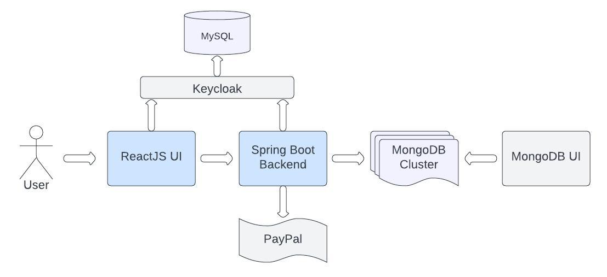

# E-Commerce Application 

Spring Boot application integrated with MongoDB and Keycloak. PayPal SDK is used for processing payments.
UI framework: React JS.

Application allows to view list of products, add them to cart, create orders and execute payments.

## Project details

`docker-compose.yml` contains several services:

- 3 MongoDB nodes making up a cluster
- MongoDB UI
- MySQL database for Keycloak
- Keycloak
- Spring Boot backend application with REST endpoints
- React JS UI, that calls Keycloak and backend application endpoints

MongoDB is automatically initialized with three products (see `mongo-init.js` file).

Keycloak configuration is stored in `e-commerce-realm.json` file, which is applied automatically.
It has 3 preconfigured users: `user1@example.com`, `user2@example.com` and `user3@example.com`. All of them have
`USER` role and password `password`.

## How to Run

1. Create account in PayPal (skip steps where your credit card is needed) and create API Credentials
   on [Developer Dashboard](https://developer.paypal.com/dashboard/). Paste client ID and client secret in `.env` file
   in this project.
2. Run `chmod 400 mongo-replication.key` to avoid issue with too open key permissions in MongoDB. You
   can create your own key if issue persists.
3. Run `docker-compose up -d` to start all services. Note that backend application will start only after
   MongoDB cluster is healthy which takes time.
4. Visit http://localhost:3000 in your browser. Log in with users listed in [Project details](#project-details).
5. (Optional) Import `E-Commerce.postman_collection.json` file to your Postman to call backend endpoints. Generate
   access token using `Get Token` endpoint and add it to collection's Authorization tab to call protected endpoints.
6. (Optional) Visit http://localhost:8081 to explore data in MongoDB.
7. (Optional) Visit http://localhost:8080/swagger-ui/index.html to explore backend application REST API documentation.
8. (Optional) To use Keycloak UI add `127.0.0.1 keycloak` line to `/etc/hosts` file on macOS
   or `c:\Windows\System32\drivers\etc\hosts` on Windows and visit `http://keycloak:8082`.
   Admin - `admin`, password - `password`.

Note: when paying in PayPal you don't need to log in. It's better to use `Pay with a Bank Account or Credit Card`
option (it you don't see it, try to increase order total price by adding more items to cart).
Use test credit card from this page: https://developer.paypal.com/api/rest/sandbox/card-testing/

## Technical notes

- Spring Boot 3 and Java 17 are used.
- Code coverage threshold: 85%.
- Tests: JUnit 5, Mockito, MockMvc.
- Checkstyle is configured.
